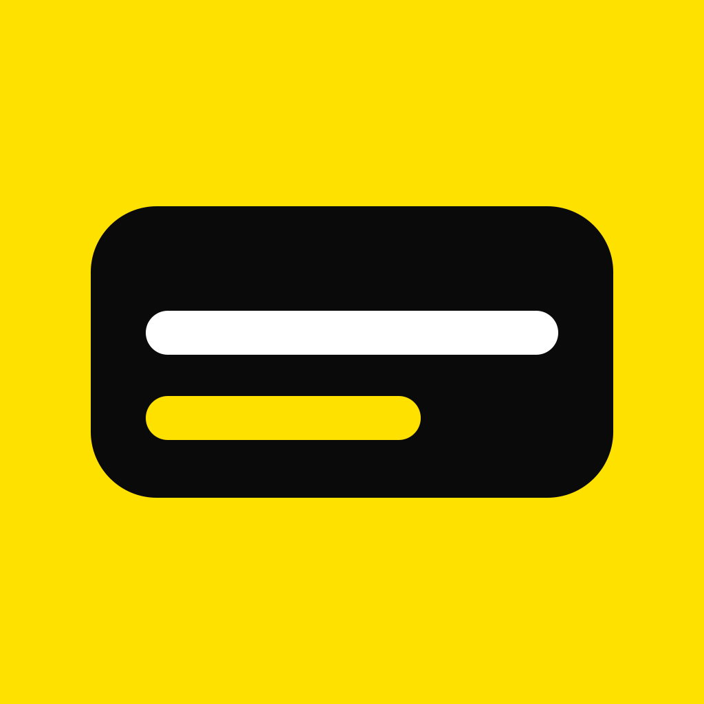
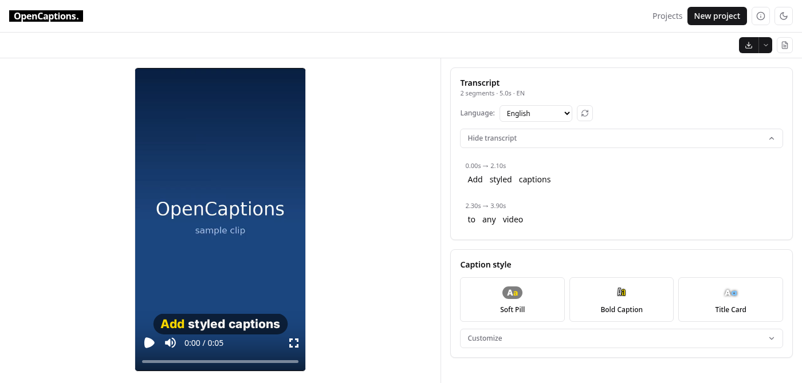

<div align="center">



# OpenCaptions

**Animated captions for your videos. Open source, self-hosted, and on your iPhone.**

Transcribe with Whisper, style every word, and export a burned-in video or subtitle files.
Nothing leaves your machine unless you say so.

[](LICENSE)
[](https://github.com/leogaudin/opencaptions/actions/workflows/ci.yml)
[](#status)



</div>

## Features

- **Word-level transcription** with faster-whisper on your machine, the OpenAI API with your own
  key, or another OpenCaptions server (a GPU box at home, say)
- **Animated styles** with presets and a full custom panel: fonts, colours, outline, background,
  animation, position
- **A real editor**: a timeline to retime captions, fix a misheard word right on the video
- **Export** a burned-in MP4, WebM or ProRes, or SRT, VTT and JSON
- **The preview is the export**: one Rust engine draws both, so what you see is what you get
- **iPhone and iPad app** with on-device Whisper, no server and no account
- **Many scripts and languages**: Latin, Cyrillic, Arabic, Hebrew, Indic, Thai, CJK and more, and
  an interface in 13 languages
- **Private by design**: no telemetry, no tracking, accounts are local to your instance

## Quick start

You need Docker Compose v2.24 or newer and one file:

```bash
curl -O https://raw.githubusercontent.com/leogaudin/opencaptions/main/docker-compose.yml
docker compose up -d
```

Open <http://localhost:5173>, create an account, drop a video in.

To build from source instead, clone the repository and run `docker compose up -d --build`
(or `make up`).

> The web UI listens on every interface and signup is open. On a shared network or a public
> host, read [Security](docs/SELF-HOSTING.md#security) first.

## More

- [Self-hosting](docs/SELF-HOSTING.md): configuration, the HTTP API, security, GPU acceleration,
  backups
- [Design](docs/DESIGN.md): how it works, including the engine and the iOS app
- [iOS app](apps/ios/README.md): building and running it
- [Contributing](CONTRIBUTING.md): dev setup and the acceptance gate (`make ci`)
- [Security policy](SECURITY.md): threat model and reporting a vulnerability

## Status

Pre-v0.1: under active construction, and APIs and schemas may change until the first tagged
release.

## License

[AGPL-3.0-only](LICENSE). If you offer a hosted version of OpenCaptions, the AGPL requires you to
publish your modifications. Contributors accept a [CLA](CLA.md) so the maintainer can also ship
the code where the AGPL cannot go, such as the App Store. Third-party components keep their own
licences, see [NOTICE](NOTICE).

Built and maintained by [Leo Gaudin](https://github.com/leogaudin).
Support the project on [GitHub Sponsors](https://github.com/sponsors/leogaudin).
